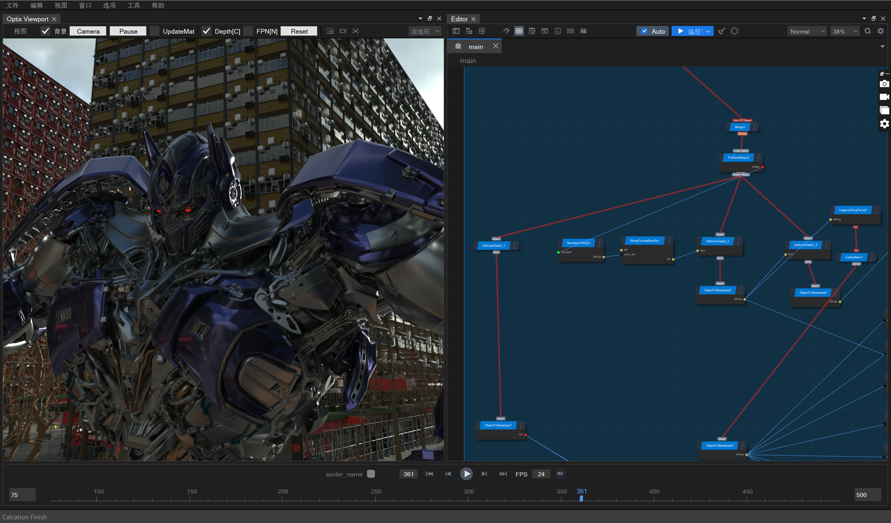
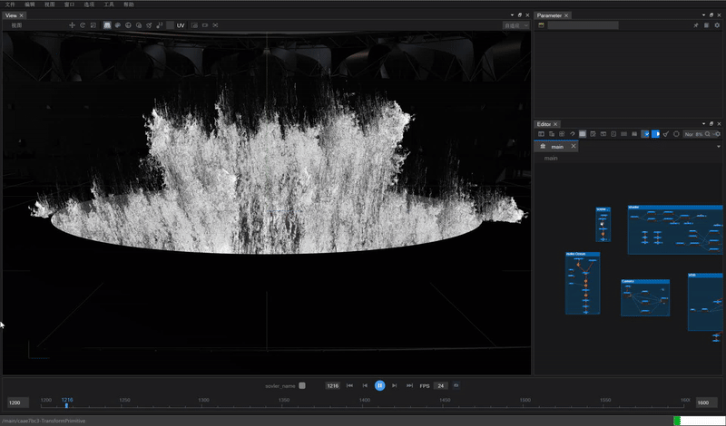
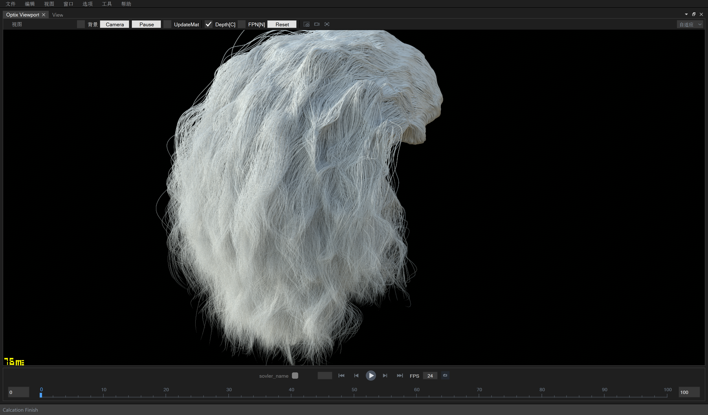

# ZENO node system

ZENO is an open-source, Node based 3D system able to produce cinematic physics effects at High Efficiency, it was designed for large scale simulations and has been tested on complex setups.
Aside of its simulation Tools, ZENO provides necessary visualization nodes for users to import and run simulations if you feel that the current software you are using is too slow.
Open-source node system framework, to change your algorithmic code into useful tools to create much more complicated simulations!

## Features
- [Graph Node Editor](docs/feature_grapheditor.md)
- [Geometry Manipatuion](docs/feature_calculation.md)
- [ZFX Script System](docs/feature_zfx.md)
- [Zeno Digital Asset](docs/feature_zda.md)
- [Software Extension](docs/feature_extension.md)

## Gallery

### Procedural Terrain

### Scene Assembler For Large Scale Rendering

### Fluid simulation
 
*Tidal Show at the Opening Ceremony of the Hangzhou Asian Games*

### Rigid simulation

### Hair Rendering

# Developer Build

To build ZENO from source, you need:

- GCC 9+ or MSVC 19.28+, and CMake 3.16+ to build ZENO.
- Qt 5.14+ to build the ZENO Qt editor.
- (Optional) TBB for parallel support.
- (Optional) OpenVDB for volume nodes.
- (Optional) Eigen3 for solver nodes.
- (Optional) CGAL for geometry nodes.
- (Optional) CUDA 11.6 for GPU nodes.

> Hint: WSL is not recommended because of its limited GUI and OpenGL support.

- [Click me for detailed build instructions](BUILD.md)

# Bug report

If you find the binary version didn't worked properly or some error message has been thrown on your machine, please let me know by opening an [issue](https://github.com/zenustech/zeno/issues) on GitHub, thanks for you support!

# Miscellaneous

## Contributors

Thank you to all the people who have already contributed to ZENO!

- [Contributor guidelines and helps](docs/CONTRIBUTING.md)

## Legacy version of Zeno

Currently the [`master`](https://github.com/legobadman/zeno) branch is Zeno.
You may find Old Version Zeno in this repository (https://github.com/zenustech/zeno) branch.

## License

ZENO is licensed under the Mozilla Public License Version 2.0, see [LICENSE](LICENSE) for more information.

ZENO have also used many third-party libraries, some of which has little modifications. Their licenses could be found at [docs/licenses](docs/licenses).

## Contact us

You may contact us via WeChat:

* @zhxx1987: shinshinzhang

* @legobadman: zhihao-lu
