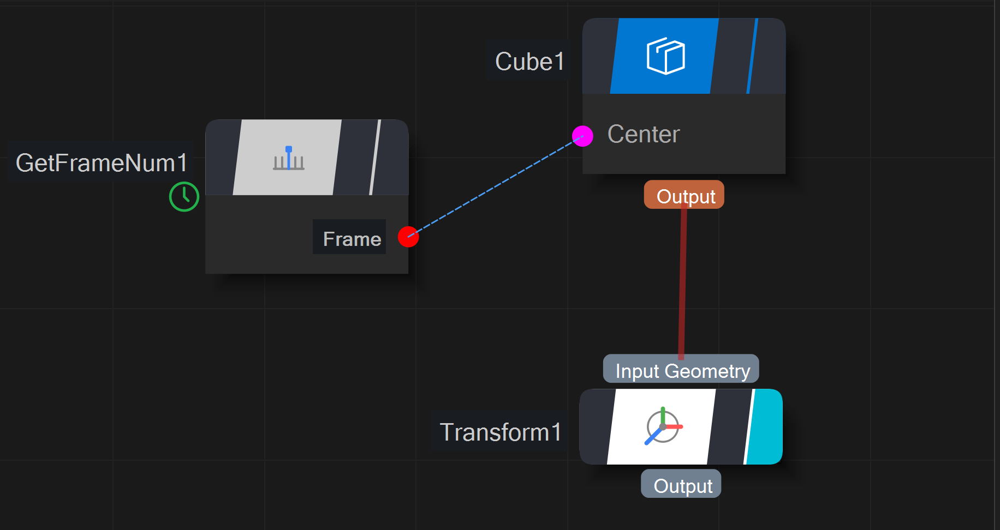
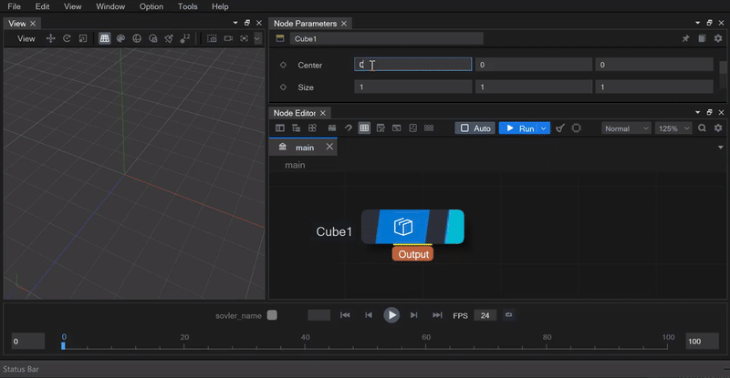
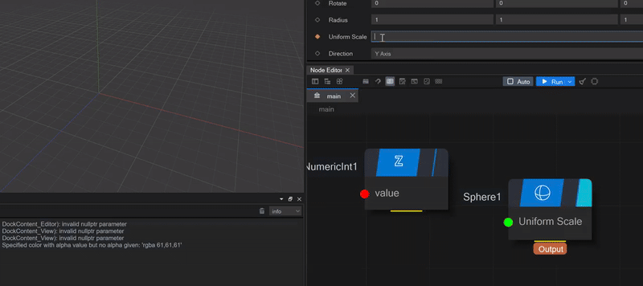
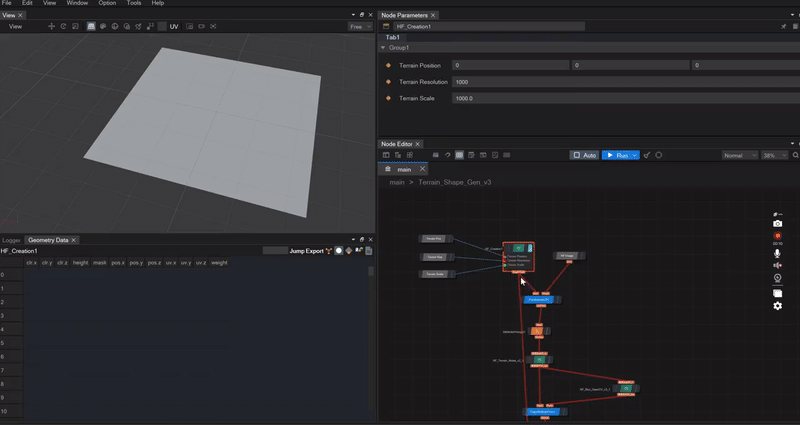
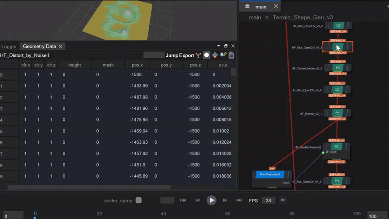

## 节点图编辑器

ZENO 图节点编辑器在新版本上得到了简化，区分了对象输入和数值型的输入

支持在参数面板直接输入公式，避免大量连节点进行计算

支持了公式和引用机制，并显示了引用线，以表示参数之间的引用关系:

## 图计算和几何缓存优化

相较于之前版本的Zeno，此版本在计算和缓存上做了诸多优化，为了让用户能更方便查看整个计算链路的结果，计算过程中每个节点的对象都会缓存下来，并可通过数据面板查看：

为了更好节省由于缓存对象带来的内存问题，新版本采用了“内存共享”和“写时复制”机制。如果上下游节点分别处理的几何对象使用了同样的属性，那么属性值的内存结构将会共享，拓扑数据同理，并且只有在下游节点修改部分属性时，才会拷贝出新的数据。

（上述不同节点的同名属性值的内存都是共享的）

## 新Zfx脚本解析语言
新开发的Zfx脚本解析语言，可以支持常用的C系语法，比如if else，条件表达式，for循环，以及若干常用的几何api

## SceneAssembler渲染机制

## 插件化，资产文件和命令行程序

