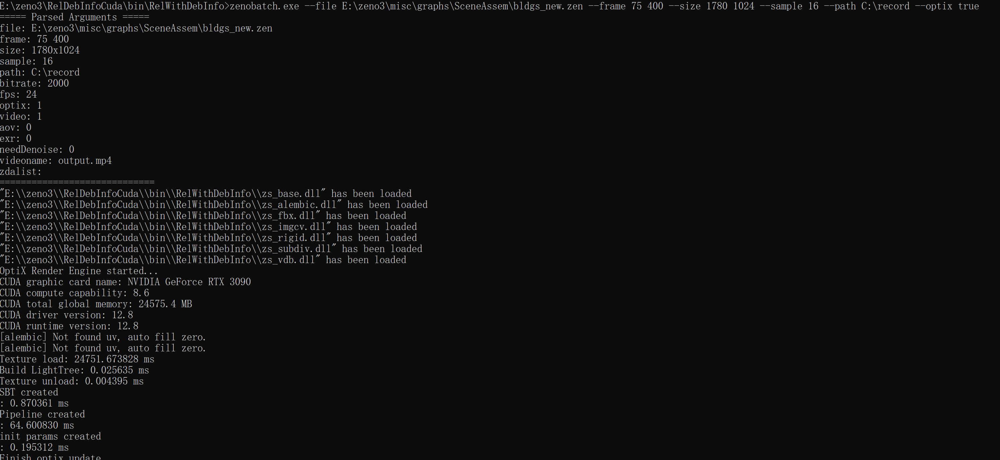
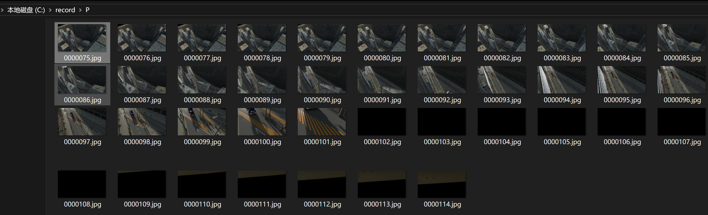

## 插件化
新版Zeno支持自定义插件，用户可以根据自己的功能需求，自定义插件dll，并通过ZENO加载，以下是官方代码自定义的插件：
- zs_base.dll，包含所有基础几何节点、流程处理节点和其他常用的节点，zeno启动时就会自动加载
- zs_fbx.dll，包含FBX工程文件的处理节点
- zs_cuda.dll，包含CUDA相关的节点
- zs_imgcv.dll，包含图片处理相关的节点
- zs_rigid.dll，包含刚体解算相关的节点
- zs_vdb.dll，包含openvdb相关的节点
- zs_alembic.dll，包含对abc文件处理相关的节点


## 命令行程序

新版Zeno可以通过zenobatch，运行批处理程序，这样无须创建用户界面相关的属性，直接通过计算图，并指定渲染参数，最后渲染出图片和录制视频

到Zeno目录下，运行以下命令：
```
zenobatch.exe --file E:\zeno3\misc\graphs\SceneAssem\bldgs_new.zen --frame 0 70 --size 1780 1024 --sample 16 --path C:\record --optix true
```

然后zenobatch.exe会逐帧运行，待计算完成后，渲染端对计算对象，按照特定的参数进行渲染，最后录制到特定的目录：


*上图展示命令行录制，首先要加载各个插件，然后初始化CUDA Optix渲染引擎，后续就是计算和渲染*


然后在指定目录可以看到程序录制的渲染结果：
