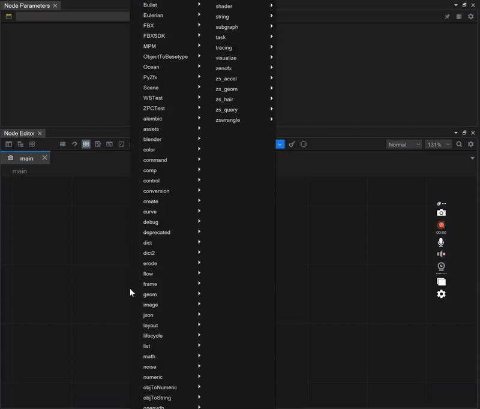
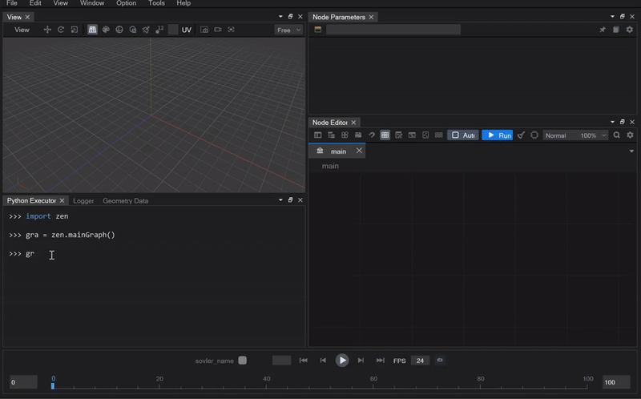
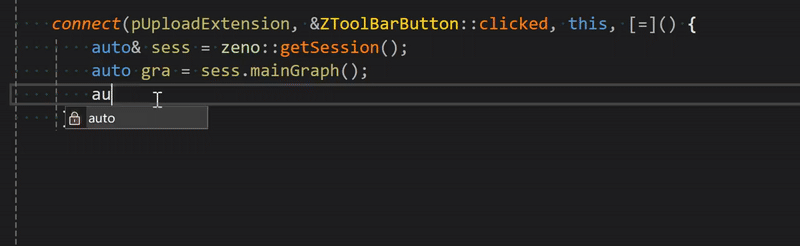
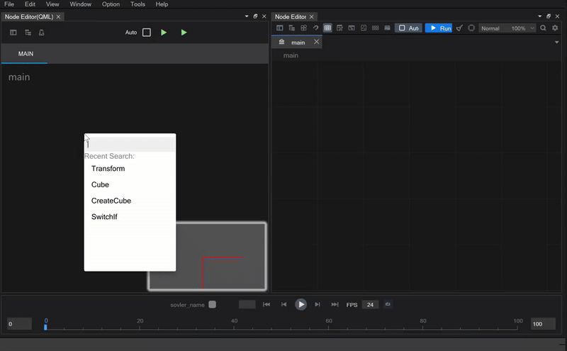

## 节点图编辑器

### 参数类型区分
ZENO 图节点编辑器在新版本上得到了简化，区别于老版本ZENO混杂了数值和对象，区分了对象输入和数值型的输入：

*图1：优化参数布局，数值型参数横向连接，对象参数竖向连接。*
  

### 公式编辑
支持在参数面板直接输入公式，避免大量连节点进行计算：

  

### 引用机制
支持了公式和引用机制，以表示参数之间的引用关系:
 
*当引用关系建立时，参数之间的引用连线就会自动显示*
  

## 节点编辑器架构
新的架构采用的是MVVM模式(Model View ViewModel)，具体分为内核层(Model)，视图模型层(ViewModel)和UI层，其中内核层基于std C/C++，管理着所有计算图、节点和计算缓存的对象数据，并提供基本的增删查改api，供外层模型使用，在这个设计模式下，用户有三种方式可以操作当前工程的计算图：

1. 最简单直接的，就是在用户界面上操作

   
2. 通过python交互环境调用绑定到内核的py接口：

   
3. 直接通过内核提供的C/C++ api，操作计算图

  

## QML的尝试
在UI框架的优化尝试方面，尝试过基于Qt Quick下的节点编辑器，和现有的基于QGraphicsView体系的节点编辑器 共用一套ViewModel。

