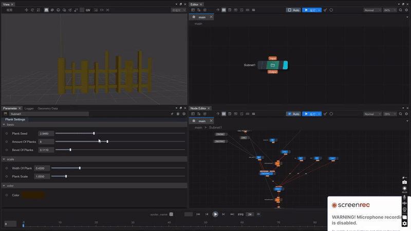
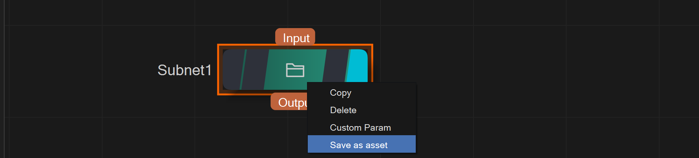
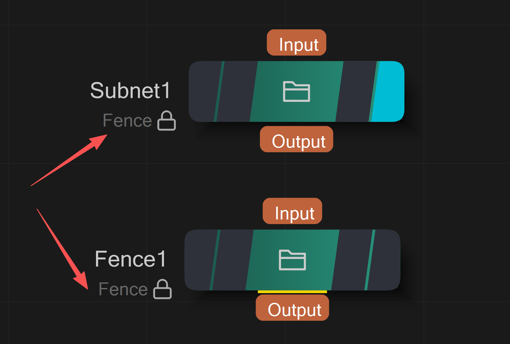
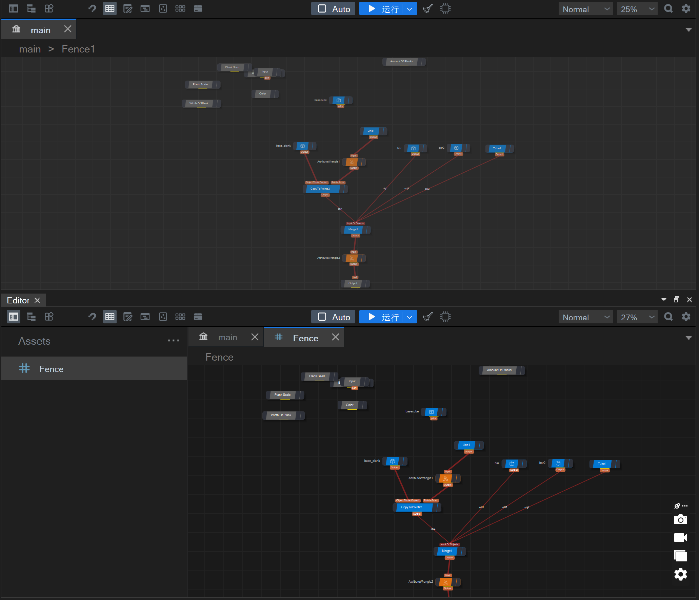
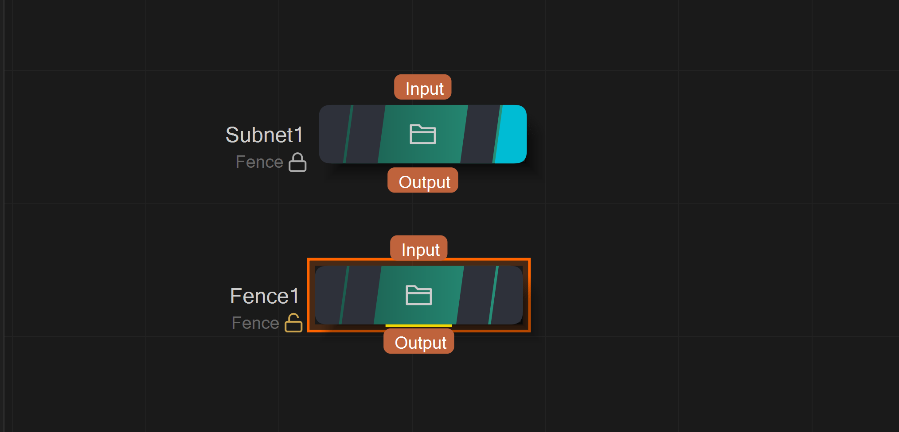
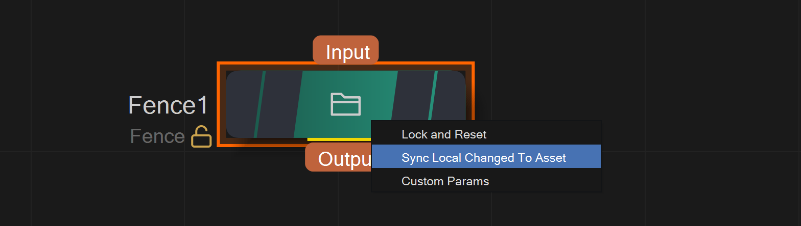
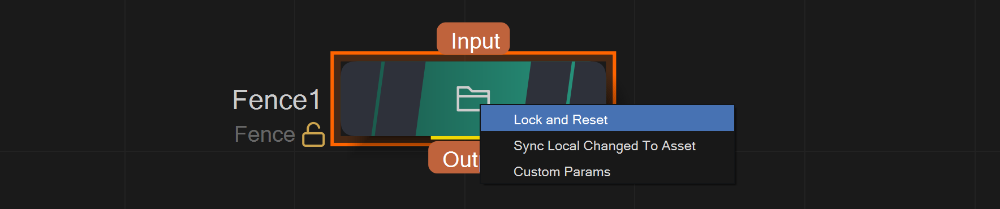
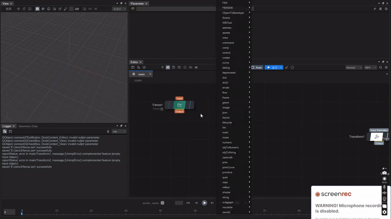

## ZENO资产文件

ZDA是ZENO Digital Assets数字资产。它可以把ZENO的节点图打包成一个节点插件，也可自定义界面和参数，可供其他ZENO工程导入使用，便于把程序化建模，流体解算等领域的问题模块化。

为了展示zda的作用，我们首先创建一个子图，用于建模一个特定结构的几何体：

*上图展示了用一个子图创建一个几何体，并添加了自定义参数，以控制几何的细节，其中右上是子图节点，右下是子图节点内部的图* 
 

为了让这个子图结构模块化，我们可以基于这个子图结构，创建一个资产文件：

*上图使用了Subnet1创建一个zda文件，然后直接新建一个新的实例，也就是上图的Fence1节点*

我们可以直接在工程里打开zda文件，直接编辑zda文件，而asset实例无法编辑，处于锁定状态：

基于这个zda，我们可以在不同的项目里，创建一个个资产实例（其实就是一个个子图节点）
对于zda，有以下几个常用的功能：
- 锁定与解锁

*上图中的Subnet1处于锁定状态，而Fence1被解锁后，可以自由编辑修改*

- zda同步到各个子图实例

*解锁后的资产子图，在修改后，可以同步到zda文件和各个其他的实例，比如锁定的节点Subnet1*

- 还原zda

*修改后的Fence1节点，如果希望放弃之前的修改，回到公共的Fence资产的状态，可以选择Reset*

 
 
以下是一个完整的例子：

