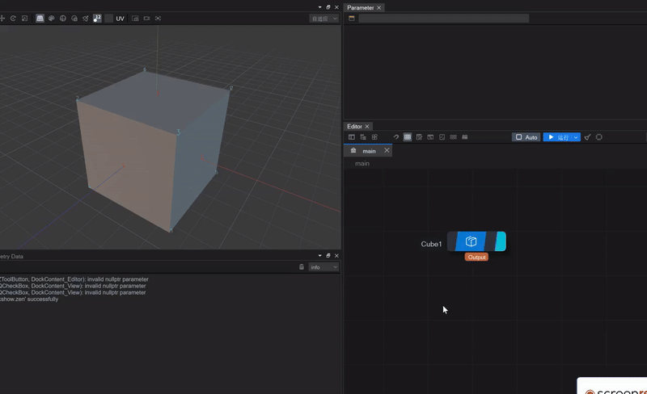
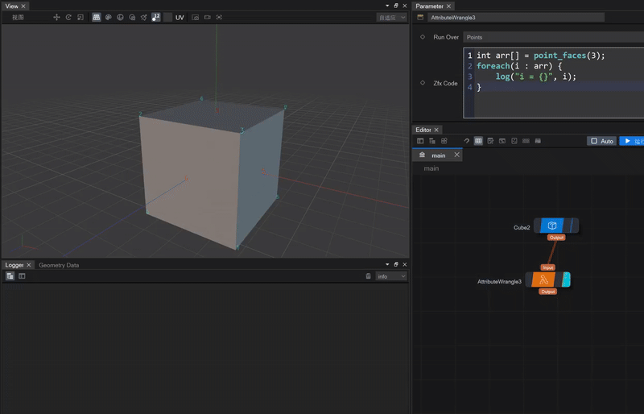

## 新Zfx脚本解析语言

### 基础语法
新开发的Zfx脚本解析语言，可以支持常用的C系语法，比如if else，条件表达式，for循环，以及若干常用的几何api

1. 采用类C的类型系统，除了支持int,float,string，还支持数组和向量：


<br>
   
2. 支持常见的控制流语句，比如ifelse，条件表达式，for/foreach


<br>

### 属性处理
Attribute Wrange下的zfx归根结底是对对象属性的处理，由于属性是多维向量，zfx支持“语法操作向量化”，也就是可以通过单变量定义出整个属性向量：


*上图得到的pt不单是一个整型数，而且枚举了所有点的结果，这样就不需要定义一个容器接收所有的点，更便于几何操作*


### 几何api操作
- add_face(vector<int> points, bool bClose)<br>
基于几何体已有的点添加一个面<br>
   <br>

- remove_point(int ptnum)<br>
从几何体中移除其中的一个点<br>
   <br>
   <br>


- vector<int> point_faces(int ptnum)<br>
给定几何体的一个点，返回点周边的所有面<br>
   <br>
   上图展示了获取3号顶点周边的面（用红色数字表示），并打印出来<br>
   <br>

以下是支持的几何api：

```
/* 添加元素 */
int add_vertex(int face_id, int point_id);
通过face_id指定的面，指定point_id的点作为face_id面内的一个顶点。
返回这个顶点的linear index

int add_point(vec3f pos);
往几何体上添加一个点，位置由pos指定，返回新添加点的序号

int add_face(vector<int> points, bool bClose);
往几何体上添加一个面，通过points指定的点作为这个面的组成，bClose表示是否闭合，返回新添加面的序号
```


```
/* 移除元素相关 */
bool remove_faces(set<int> faces, bool includePoints);
移除若干个面，由faces指定，includePoints表示是否连面上的点都移除

bool remove_point(int ptnum);
移除由ptnum指定的点

bool remove_vertex(int face_id, int vert_id);
移除face_id下第vert_id个顶点
```

```
/* 返回元素个数 */
int npoints() const;
int nfaces() const;
int nvertices() const;
int nvertices(int face_id) const;
int nattributes(GeoAttrGroup grp) const;
```

```
/* 点相关 */
vector<int> point_faces(int point_id);
返回point_id指定的点，周围由哪些面组成，返回这些面的序号

int point_vertex(int point_id);
返回一个由point_id指定的点在几何体上对应一个顶点的linear index

vector<int> point_vertices(int point_id);
返回一个由point_id指定的点在几何体上对应所有顶点的linear index
```

```
/* 面相关 */
int            face_point(int face_id, int vert_id);
返回face_id面下第vert_id个顶点所对应的点序号。

vector<int>    face_points(int face_id);
返回面face_id下所有的点的序号。

int            face_vertex(int face_id, int vert_id)
返回面face_id下第vert_id个顶点的linear index。

int            face_vertex_count(int face_id)
返回面face_id的顶点数。

vector<int>    face_vertices(int face_id);
返回面face_id所有顶点的linear index。

vec3f          face_normal(int face_id);
返回面face_id的法线
```

```
/* Vertex相关 */
int vertex_index(int face_id, int vertex_id)
返回面face_id下第vert_id个顶点的linear index。

int vertex_next(int linear_vertex_id)
返回linear_vertex_id下指定的顶点的下一个顶点的linear index

int vertex_prev(int linear_vertex_id)
返回linear_vertex_id下指定的顶点的上一个顶点的linear index

int vertex_point(int linear_vertex_id)
返回linear_vertex_id指定顶点对应的点序号

int vertex_face(int linear_vertex_id)
返回linear_vertex_id指定顶点对应的面的序号

int vertex_face_index(int linear_vertex_id);
将linear_vertex_id转为它所在的那个面上的idx（就是2:3里面的3）;
```
