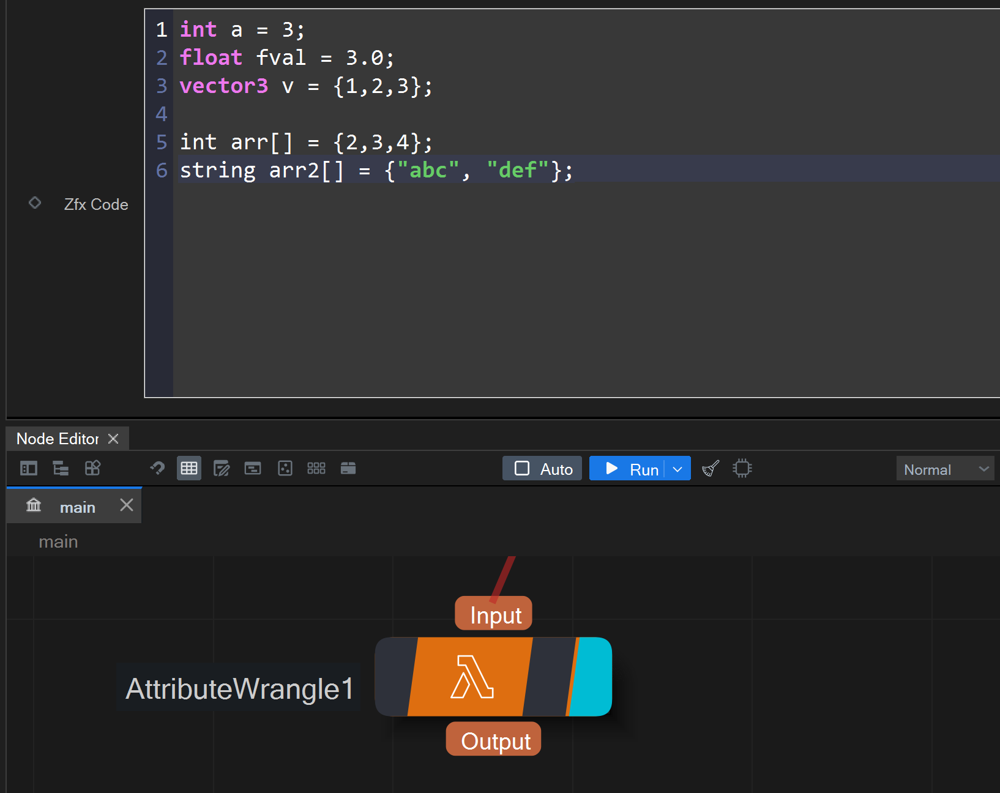
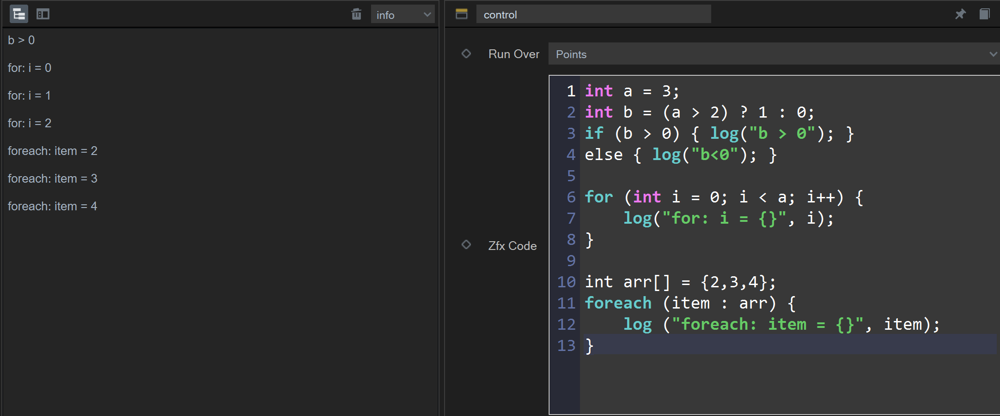
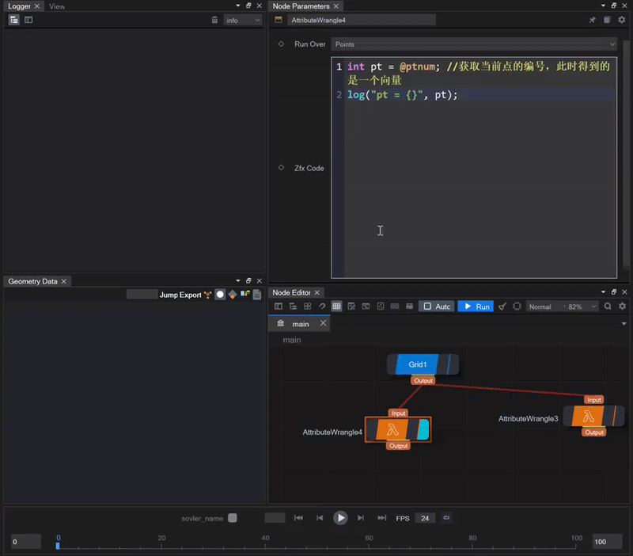

## 新Zfx脚本解析语言
新开发的Zfx脚本解析语言，可以支持常用的C系语法，比如if else，条件表达式，for循环，以及若干常用的几何api

1. 采用类C的类型系统，除了支持int,float,string，还支持数组和向量：
    
    
   
2. 支持常见的控制流语句，比如ifelse，条件表达式，for/foreach
   
    

   
3. 针对属性的处理，zfx支持“语法操作向量化”，也就是可以通过单变量定义出整个属性向量：
   
   (上图得到的pt不单是一个整型数，而且枚举了所有点的结果)
    

   这样就不需要定义一个容器接收所有的点，更便于几何操作：
   

   
4. 支持常见的几何api操作：
